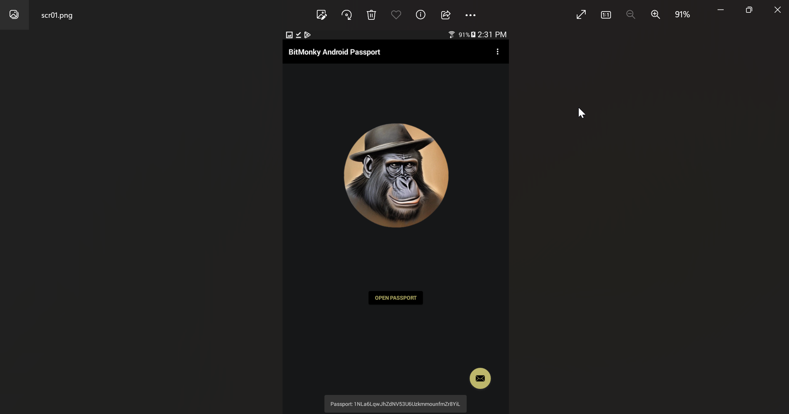

# bmgpPassport
Wallet App and password free web service access

Can be used to create password free web services for Android and desktop applications.



Android version available in google play store..  search for BitMonky

# How to create a password free service for you website using BitMonky Passport

1. Define an endpoint for your service API like this.
```javascript
     Service {
         host : ‘www.yourdomain.com’,
         port :  ‘’,   // leave blank for default SSL port 
         endPoint , ‘/yourAPI.php’   //  PHP for this example 
     }  
```
2. Create a relational table like this example.
```
CREATE TABLE `tblwzMUID` (
  `muidID` bigint(20) unsigned NOT NULL AUTO_INCREMENT,
  `muidWzUserID` bigint(20) ,           //relate this to your systems user accounts file
  `muidMUID` varchar(84),  
  `muidToken` varchar(64),
  `muidTokenDate` datetime,
  `muidAccLock` int(11),
  PRIMARY KEY (`muidID`),
  UNIQUE KEY `muidID_UNIQUE` (`muidID`),
  UNIQUE KEY `muidMUID_UNIQUE` (`muidMUID`),
  KEY `ndxMuidWzUserID` (`muidWzUserID`),
)
```
3.  Install the NodeJS BitMonky Passport Authorization Server from github
     https://github.com/bitmonky/passportAuthSrv
 
4. Create or alter your current login script to input these two fields.
     https://yourdomain.com/mbrLogin?muidID=String84&Token=String64

Instead of validating your userID/Login with your password and user file validate the login using your SQL table tblwzMUID something like this.
``` PHP
$sessExpireTime = 100  // replace with your systems session expire time;

$loginMUID   = safeGET('muidID');
$loginAccess = null;
if ($loginMUID){
  $SQL  = "select timestampdiff(second,muidTokenDate,now())txp, email, muidToken from tblwzMUID ";
  $SQL .= "inner join tblYourUsers on yourUserID = muidWzUserID ";
  $SQL .= "where muidMUID = '".$loginMUID."' ";
  $presult = mkyMsqry($SQL);
  $tpRec = mkyMsFetch($presult);
  if ($tpRec){
    $loginToken = safeGET('pToken');
    if ($loginToken){
      $tExp = $tpRec['txp'];
      if ($loginToken != '' && $tpRec['muidToken'] == $loginToken && $tExp !== null && $tExp < “$sessExpireTime){
       $loginAccess = true;
      }
    }
  }
}
// Log the user access as if they had provide an authentic userID / Password
```
   
6.  Create your Service API similar to this PHP example
``` PHP
$j   = file_get_contents('php://input');
$inJ = $j;
$j   = json_decode($j);

if (!$j){
  exit('API: json required:'.$inJ);
}

$PTC_peerLOGIN = "https://localhost:13380";
$wAddress = clean($j->Address);
$sesTok   = clean($j->sesTok);
$pubKey   = clean($j->pubKey);
$sig      = clean($j->sesSig);
$action   = clean($j->action);


$SQL = "select muidMUID from tblwzMUID  where muidMUID = '".$wAddress."' ";
$res = mkyMsqry($SQL);
$rec = mkyMsFetch($res);
if ($rec){
  $login = authenticate($wAddress,$sesTok,$pubKey,$sig);
  if (!$login){
    exitEr('log JSON fail');
  }
  $data  = json_decode($login->data);
  if ($data->result){
    if ($action == 'sendLoginToken'){

      $newToken = makeBC_MUID(hash('sha256',$sig));
      $SQL = "update tblwzMUID set muidToken = '".$newToken."',muidTokenDate = now() where muidMUID = '".$wAddress."' ";
      mkyMyqry($SQL);
      $j = new stdClass;
      $j->action = $action;
      $j->result = true;
      $j->accToken = $newToken;
      $j->msg = 'Access Granted:';
      exit(json_encode($j));
    }
    if ($action == 'lockLogins'){
      doUpdateAccLockTo($j,$wAddress,1);
    }
    if ($action == 'unLockLogins'){
      doUpdateAccLockTo($j,$wAddress,null);
    }

    exitEr('login From Peer Failed',$data);
}
exitEr('Sorry No Account On File For This Wallet',$j);

function exitEr($msg,$data=null){
  $j = new stdClass;
  $j->result = false;
  $j->error  = $msg;
  $j->data   = $data;
  exit(json_encode($j));
}
function doUpdateAccLockTo($inJ,$wAddress,$setting){
  $j = new stdClass;
  $j->action = $inJ->action;
  $j->result = true;
  $j->actionRes = false;

  if (!$setting){
    $setting = 'null';
  }
  $SQL = "update tblwzMUID set muidAccLock = ".$setting." where muidMUID = '".$wAddress."' ";
  if (mkyMyqry($SQL)){
    $j->actionRes = true;
  }
  exit(json_encode($j));
}
function authenticate($wAddress,$sesTok,$pubKey,$sig){
  $login = new stdClass;
  $login->ownMUID = $wAddress;
  $login->pubKey  = $pubKey;
  $login->sesTok  = $sesTok;
  $login->sig     = $sig;

  $post = new stdClass;
  $post->url   = $GLOBALS['PTC_peerLOGIN']."/netREQ";
  $post->postd = '{"msg":{"req":"verifyLogin","login":'.json_encode($login).'}}';

  $bcRes = tryJFetchURL($post,'POST');
  return $bcRes;
}
function tryJFetchURL($j,$method='GET',$timeout=5){
    $resp = new stdClass;
    $crl = curl_init();
    curl_setopt ($crl, CURLOPT_CUSTOMREQUEST, $method);
    curl_setopt ($crl, CURLOPT_SSL_VERIFYHOST, 0);
    curl_setopt ($crl, CURLOPT_SSL_VERIFYPEER, 0);
    curl_setopt ($crl, CURLOPT_URL,$j->url);
    curl_setopt ($crl, CURLOPT_RETURNTRANSFER, 1);
    curl_setopt ($crl, CURLOPT_CONNECTTIMEOUT, $timeout);
    curl_setopt ($crl, CURLOPT_FOLLOWLOCATION, true);
    curl_setopt ($crl, CURLOPT_USERAGENT,safeSRV('HTTP_USER_AGENT'));
    curl_setopt ($crl, CURLOPT_MAXREDIRS,5);
    curl_setopt ($crl, CURLOPT_REFERER, 'your domain');
    curl_setopt ($crl, CURLOPT_HTTPAUTH, CURLAUTH_BASIC);
    if ($method == 'POST'){
      $j->post = "sending post data:".$j->postd;
      curl_setopt ($crl, CURLOPT_POSTFIELDS, $j->postd);
    }

    curl_setopt ($crl, CURLOPT_HTTPHEADER , array(
      'accept: application/json',
      'content-type: application/json')
    );

    $resp->data  = curl_exec($crl);
    if ($resp->data === null) {
      $resp->data = "Document tryJFetchURL  ".$j->url." Failed";
    }

    $resp->error = false;
    if ($resp->data === false) {
      $resp->error = curl_error($crl);
    }
    else {
      $info = curl_getinfo($crl);
      $resp->rcode = $info['http_code'];
      $resp->furl  = curl_getinfo($crl, CURLINFO_EFFECTIVE_URL);
    }
    curl_close($crl);
    return $resp;
}
```

That is all there is to do.  Once your service is ready download the BitMonky PassPort App and create an account.  Once you have your account click on the Services button and click the ‘Register My Service’ link.

You will need a 500x500 pixel Icon image and a 1200x400 banner image loaded on your sites web server to complete the registration process.


